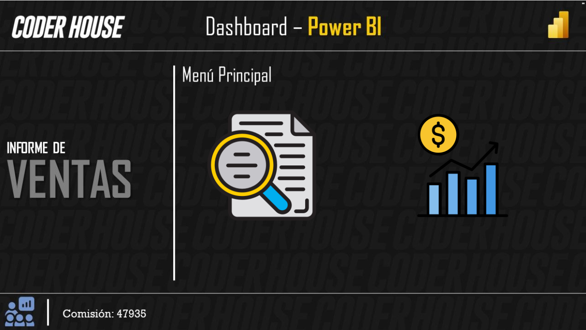
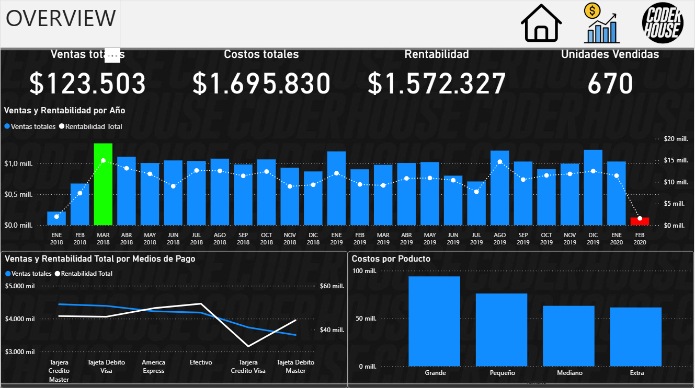
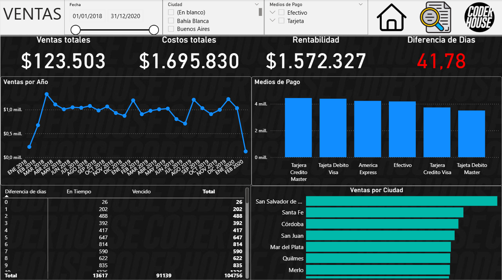

# 📊 Power BI Sales Analytics Dashboard

## 📌 Business Problem

Companies need structured insights into sales performance to optimize revenue, monitor profitability, and evaluate sales team effectiveness.

This project analyzes commercial performance using a dimensional data model (Star Schema) to ensure scalable and efficient reporting.

---

## 🗂 Data Model

The solution was built using a Star Schema structure:

- Fact Table:
  - Fact Ventas

- Dimension Tables:
  - Dim Clientes
  - Dim Producto
  - Dim Vendedor
  - Dim Medios de Pago
  - Dim Territorio

This modeling approach improves performance, scalability, and analytical flexibility.

---

## 📈 Key Metrics

- Total Sales
- Revenue by Product
- Sales by Territory
- Sales by Vendor
- Sales Distribution by Payment Method
- Time-based Performance Analysis

---

## 🛠 Tools & Techniques

- Power BI
- DAX Measures
- Data Modeling (Star Schema)
- KPI Design
- Sales Performance Analysis

---

## 📊 Dashboard Preview

---

## 🚀 Project Type

Business Intelligence Project  
Developed as part of advanced BI training, applying real-world commercial analytics concepts.

---

## 👤 Author

Juan Segundo Gnarra  
Actuarial Science Student | BI & Data Analytics

Enhance README with professional project structure
